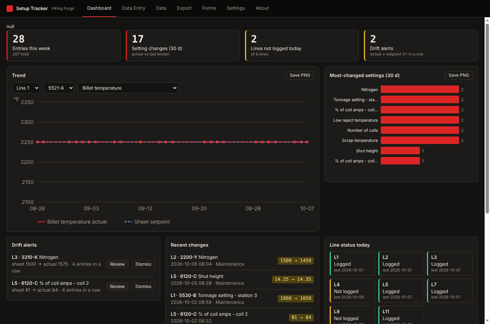

# Setup Tracker

Log checked-off press setup sheets and see what changed day to day, per **Line + Part**. Single user, all local, Windows desktop app (Electron + SQLite).



## Install

Download `Setup-Tracker-<version>-setup.exe` from [Releases](../../releases) and run it. The installer is unsigned, so Windows SmartScreen shows *More info → Run anyway* once.

Data lives in `%USERPROFILE%\.setup_tracker\` (`setups.db`, `config.json`, `profiles.json`, `backups\`, `photos\`). Nothing leaves the PC.

## What it does

| Tab | |
|---|---|
| **Dashboard** | KPIs, trend chart (actual vs sheet setpoint, optional compare-lines), most-changed settings, drift alerts, recent changes, line status today |
| **Data Entry** | Blank fill-in form per line's sheet form. Gray placeholders and a *Last* column show previous values; changed cells go yellow, actual ≠ setpoint orange. *Fill blanks with last values*, *Clear*, `Ctrl+S`. **A new part's first entry is its sheet: setpoints only** (no actuals or readings; “Also enter actual values now” overrides). From the next entry on, actuals are asked, with the sheet value as the gray hint |
| **Data** | Filterable table sorted by line. Editable notes, reasons, photos. *Revise* (a new entry), *Correct* (replaces a wrong entry), *Void* (takes it out of change detection, with a reason; *Show voided* lists them) |
| **Export** | CSV / XLSX (one part or all, date range, reasons) and the weekly change report (PDF, optional auto-create on app start) |
| **Forms** | Add, renumber, copy and delete forms; choose which fields each form carries and whether each is *Tracked* (asked every entry) or *Set once* (asked on the first entry for a Line + Part); add, edit or remove fields; download a form as an Excel template and import an edited one back |
| **Settings** | Fields (hide / rename / add for all forms), line → form map, parts (rename, or merge two spellings into one history), optional features, backup & restore, audit log, theme, date format, sample data, import of the v3 Python database |
| **About** | Version, local-data statement, roadmap |

Change rules (`docs/SPEC.md` §4): each setting's actual is compared to the last known non-blank value for that Line + Part; blanks are ignored; `2300` equals `2300.0`; text ignores case and extra spaces; readings (heat #, PTP, tonnage, …) never count as changes; entries are append-only (a wrong one is voided, not deleted). A Part No. with no history on its line asks for confirmation and suggests near matches, so a typo cannot silently start a new history.

### Field types

Every field has a type that decides its entry box, what is accepted, how "changed" is judged and whether it can be charted. Values are stored in one canonical form, so `6:05 PM` and `18:05` are the same value.

| Type | Entry | Accepts | Charted |
|---|---|---|---|
| Number | text | `2250`, `14.25`, `1,200` | yes |
| Text | text + suggestions | anything (case/spacing matched to known spellings) | – |
| Choice | dropdown | one of the field's pick-list | – |
| Yes / No | dropdown | Yes, No (also OK / NG, Pass / Fail) | – |
| Rating | dropdown | whole number 1–N (scale and floor are per field); `4/5` reads as 4 | yes |
| Ratio | text | `3/5`, `3 of 5` | yes |
| Time of day | time picker | `18:05`, `6:05 PM`, `0605` | yes |
| Duration | text | seconds, `1:30`, `1:02:03`, `1m30s` (stored as seconds) | yes |
| Date | date picker | `2026-03-09`, `3/9/2026` | – |

Number, Duration and Time of day can have a min / max: a value outside it is outlined, never blocked. A value that does not fit its type is refused on save with the field named.

### Loading old setup sheets (history)

Export → **Load old setup sheets from Excel** (also Settings → Data). Download a **history template** for a form: one row per setup sheet, with Line, Part No., Date/Time, entered-by / rev / HMI, reason, notes, a *Source file* column (the PDF a row came from, kept in the entry's notes) and a *Review* column (a hard-to-read handwritten value, kept as “NEEDS REVIEW”), then a setpoint and an actual column for every field on the form (readings have one). Fill it from the PDFs and **Import entries from Excel…**. The preview lists every problem by row (unknown line, bad date, a value that does not fit its type, two rows with the same line / part / time), warns about part numbers that look like typos of each other or of stored parts, skips rows that already exist, and can import the good rows while skipping the bad ones. Stored entries are never changed; a backup is taken first. Imported entries are a normal history: changes and drift are worked out from them. The app's own Excel data export can be imported the same way. Ready-made blanks for the four press forms are in `templates/history/`.

### Scanning setup sheets (OCR)

Reads PDF setup sheets, scans and phone photos **on this PC** (nothing is uploaded; the English OCR data ships inside the app).

- **Data Entry → Scan a sheet…** reads one file and fills the form from it. Nothing is saved until you check it and save as usual. Say whether the values are the printed setpoints or written-in actuals.
- **Export → Scan a folder of sheets…** reads a whole folder (sub-folders too; a folder named like “Line 7” sets the line), shows one row per sheet, and imports the ones you select as setpoints-only entries (same preview and checks as the Excel history import; a backup is taken first).
- A PDF with a real text layer is read exactly and instantly. A scanned PDF or photo goes through OCR (about 3 s a page; several sheets are read at once on a multi-core PC). A photo that is tilted, dim or turned a quarter is straightened and re-tried.
- Every value is shown for review: low-confidence values are marked **Check**, values that do not fit the field's type are **Unreadable** and are left out (and listed in the entry's notes as `NOT IMPORTED`). Sheets with anything to check are not selected by default.
- The form comes from the sheet's own `FORM#` footer, else from the press line. Sheets whose values all match what is already stored are skipped, so re-running a folder does not duplicate entries.
- Labels are matched by name, so custom fields whose label is printed on the sheet are read too. Handwriting is hit and miss with local OCR; printed and typed sheets read well.

### Excel templates

Forms → **Excel template** downloads a form (or all of them) as a workbook, one row per field: Section, Field, Type, Unit, Entry (Setting / Reading), Role (Tracked / Set once), Options, Min, Max, plus a Forms sheet (name, notes, lines). Edit or add rows in Excel (the Type, Entry and Role cells are dropdowns), then **Import template…**. A preview lists every new, edited and re-pointed item first; stored entries are never touched. Rows keep their hidden **Key** so a rename stays a rename; leave Key blank for new fields. Fields missing from the workbook are only taken off a form if you tick the option.

### Profiles (other jobs)

Settings → **Profiles** keeps one fully separate database per job: its own forms, fields, sections, entries, photos, backups, settings and audit log. **Create and open** starts either empty (then import an Excel template to define its forms) or with a copy of the current forms. Once there are two or more, a switcher appears top-right; switching reloads the window onto that database. The original data folder is the first profile, untouched; others live in `%USERPROFILE%\.setup_tracker\profiles\<name>\`. Removing a profile only takes it off the list, its files stay on disk.

Settings → **Names** renames the two identifiers for the open profile (for example *Station* and *Product* instead of *Line* and *Part No.*). Everything on screen, in exports and in the weekly report follows. The first identifier must be a whole number; the second can be any text.

`templates/` has ready-made files: `blank-form-template.xlsx` (instructions + headers), `press-setup-forms.xlsx` (the four Viking Forge forms) and `form-10899-2500T-setup-sheet.xlsx` (the printed 2500 Ton press setup sheet, field for field in the sheet's order: 42 fields, lines 5 / 7 / 9). Regenerate them with `npm run templates`.

Backups are taken on save (max one per 5 min), before restore / import / migration, kept to the newest 100. Restore runs an integrity check and backs up the current database first. Put the backup folder on a different drive (Settings → Backup & restore).

## Updates

About → **Updates** checks GitHub Releases for a newer version (shortly after start and every few hours; switch it off there). Nothing downloads or installs without your click: **Download**, then **Restart and update**. Before it installs, the open profile is backed up; the app then closes, updates in place and reopens by itself. Your data folder, profiles and settings are not touched, and a database change in a new version takes its own backup first. A header badge shows when an update is waiting. It only works in the installed app, and only for releases published with the installer (see Develop).

## Develop

```
npm install
npm start               # run the app
npm test                # unit tests (node:test)
npm run screenshots     # headless smoke run of every tab in every theme -> docs/screenshots
npm run ocr-smoke       # headless end-to-end check of sheet scanning (PDF text, scanned PDF, photo, folder import)
npm run templates       # regenerate templates/*.xlsx
npm run dist            # Windows installer in dist/ (run on Windows; Linux needs wine)
```

Set `SETUP_TRACKER_DATA_DIR` to run against a scratch data folder. Release: bump `version` in `package.json`, merge, then `git tag vX.Y.Z && git push origin vX.Y.Z` on `main`; CI builds and attaches `Setup-Tracker-X.Y.Z-setup.exe`, `latest.yml` and the `.blockmap`. The in-app updater reads `latest.yml`, so every release must carry all three, and its version must be higher than the one installed.

## Known gaps

- The factory setting names, units and sections are a starting set. Change what each form carries in the Forms tab (and rename, hide or add fields there or in Settings → Fields); the line → form mapping is in Settings.
- Dark themes only (crimson default, amber, steel).
- No code signing, so Windows SmartScreen warns on the first install (updates made from inside the app do not repeat that).
- OCR is local Tesseract: good on printed sheets and clear photos, unreliable on handwriting (everything is reviewed before saving). Tested on invented sample sheets in `tests/fixtures/ocr`; tell me which of your real sheets misread and the label matching can be tuned.
- Deferred by design: network-folder database, multi-user.
